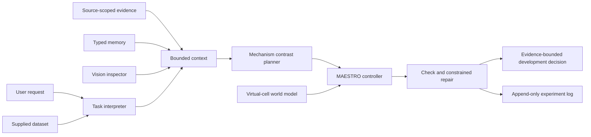

> **File summary**
> - **Path**: `README.md`
> - **Purpose**: Overview of the MAESTRO mechanism-contrast repair agent and its runtime.
> - **Core points**: agent owns decision and action selection; world model gives conditional predictions only; a contrast is checked then bounded-repaired; measurements, not predictions, constrain claims; replay evaluation uses leakage-bounded cases.
> - **Interfaces / data**: CLI `maestro-evaluate`, `maestro-build-cases`; `python -m agent`; `--policy {ordinary_llm,maestro_llm,maestro_llm_ruled,ablation}`; `actions.json`, `intervention_profile.json`.
> - **Depends on**: `task.md`, `Innovation.md`, `src/maestro/`, `src/agent/`, `src/virtual_cell/`, `data/evaluation/`.

# MAESTRO

**Mechanism-Aware Evidence-driven Scientific Agent for Therapeutic Reasoning and Optimization**

MAESTRO is a research skeleton for an agent that reasons about how pharmacological interventions change biological systems, treating the agent as decision-maker and a virtual-cell world model as a conditional prediction tool.

## Research Question

> How can a drug-discovery agent use structured biological evidence and calibrated virtual-cell world models to understand how complex pharmacological interventions change biological system states, form falsifiable mechanism hypotheses, and determine what evidence supports a target-development decision?

The reasoning unit is a target-development program: `target hypothesis + intervention strategy + biological context + intended phenotype + evidence package + unresolved assumptions`.

## Decision Architecture



The agent owns hypothesis comparison and action selection; the world model contributes only a condition-specific prediction with uncertainty and an applicability domain. Measurements, not software, constrain a biological claim. An LLM may compose the task and contrast, but a deterministic controller validates prerequisites, registered actions, discriminability, and decision separation.

## Active Scope

The first task is pharmacological functional calibration for target-program validation. When a genetic dependency and a matched pharmacological phenotype disagree, the agent must distinguish incomplete functional perturbation, intervention-mode non-equivalence, multi-target pharmacology, pathway compensation, context dependence, and unresolved mechanisms. Its output is an evidence-bounded development decision: continue, revise, change intervention mode, preserve or remove a necessary multi-target activity, defer (deferred decision), or stop.

Single-target, polypharmacology, drug-combination, and cell-cell-communication settings are instances of one state-transition question. Initial scope is cell-intrinsic; multi-drug and multicellular settings need matched measurements first.

## Core Components

- `src/maestro/`: the mechanism contrast, discriminability check, outcome rules, set-based evidence state, development decision, bounded repair ledger, source clusters, and revocable prediction reliability.
- `src/agent/`: task interpretation, bounded context, memory stores, LLM and vision clients, planner, audit, CLI, orchestration.
- `src/evaluation/`: the replay environment, the policy arms, decision scoring with its error taxonomy, and the real-data evidence base and case builder.
- `src/virtual_cell/`: intervention/context records and the applicability-bounded world-model interface.
- `tools/*/`: manifest-scoped local data tools selected only from explicit user-supplied datasets.
- `research/`: current source checks, report interpretation and executable contract documentation.

The current maestro-environment revision passes full JSON tool payloads and action catalogues to
the planner, bounds duplicate-source coverage, and declares multimodal information visibility.
See [research contracts](research/CONTRACTS.md) and the [current research basis](research/README.md).

## Interaction and State Boundaries

Each turn creates a `TaskIntent`: question, supplied evidence, targets, interventions, biological context, endpoint, constraints, missing fields, visual-review need. Missing material fields trigger a clarification, not a fabricated plan. The context builder combines task, source-scoped evidence, and status-labeled memory within a fixed size budget.

The planner returns exactly two hypotheses and selects from the caller-provided evidence menu. The controller checks executability, measured prerequisites, discriminability of the two hypotheses, and differing development actions. A failure yields one named repair or explicit deferral. A model prediction, retrieved memory, or visual interpretation never becomes measured evidence by appearing in context.

With `--dataset`, the LLM selects a bounded sequence of registered folder-scoped tools from `tools/`. The router validates declared tool, dataset id, suffix, and parameters before loading its local entry point. Dataset output is stored with file name, tool id, and tool-reported limitations. Bundled tools are schema profiling, numeric column summary, and declarative table filtering; they execute no expressions and assert no biological causality.

## Case Lifecycle and Evidence Lineage

`CaseStore` persists case id, plan version, state, budget, planned action, and result reference in a SQLite store inside the active dated run directory (see `log/INDEX.md`). A ready plan moves to `awaiting_result`; a real result must match planned action, context, time point, and declared independent-unit count before entering the evidence ledger. Repeating a result id is idempotent. A result failing quality control is retained as case state but not promoted into retrieved evidence. The bounded `run_case_loop` repeats plan, result import, and reflection only while a caller supplies a selected action's result; a missing result stops the case at `awaiting_result` and never fabricates an observation. Each imported result yields an episodic reflection (outcome class, next step, limitations). Only a qualified real result with an explicit `functional:*` interpretation field may mark that functional prerequisite measured for the next round.

Every evidence record has an explicit kind: `real_measurement`, `derived_analysis`, `retrieved_source`, `model_prediction`, or `prediction_derived_analysis`. A dataset tool writes only the kind declared in its manifest; derived analysis and prediction never become measured results by inclusion in LLM context.

On deterministic contrast-check failure, rule-based repair stays the baseline. The LLM may propose one registered replacement action and must state remaining limits. MAESTRO accepts the draft only if deterministic re-checking resolves at least one original failure; otherwise the case keeps the baseline repair and records the rejection.

## Outcome Rules, Set-Based Update, Development Decision

`src/maestro/outcome.py` makes the `Y` and `rho` components executable. An `OutcomeRule` states which interpretation fields license which update, under which measured conditions, and with which boundary. `InterpretationTable.interpret` classifies a real result before use:

| Situation | Outcome class | Update scope |
|---|---|---|
| Declared quality check failed | `quality_failed` | measurement feasibility |
| Derived analysis or model prediction | `non_measurement` | plan limitation |
| Context, time, or required condition unmatched | `condition_unmatched` | plan limitation |
| Qualified but outside registered categories | `out_of_prediction` | plan limitation |
| Qualified and matched | `predicted` | the rule's scope |

`EvidenceState` is the set of hypotheses still compatible with the evidence. Only a qualified, condition-matched result whose rule targets `mechanism_contrast` may remove a hypothesis; every other result stays in the update log with a narrower scope. The update is a set, not a posterior, so no component invents an unmeasured probability.

`src/maestro/decision.py` closes the loop section 9.4 scores. `EvidenceRequirement` declares minimum measured support for a development action; `DecisionEngine` emits `decided`, `needs_evidence`, `contradicted`, or `deferred`. An exhausted explanation set becomes `contradicted` and routes to premise revision, not a new label; exhausting the budget defers rather than confirms. Deferral is not a licensable requirement, so over-deferral cannot be the cheapest policy.

## Bounded Repair Ledger

`src/maestro/repair.py` replaces single-shot repair with a bounded loop. Each attempt records the triggering failure, the changed field, expected discriminating power, whether re-checking adopted it, and whether a later real result closed the promised gap. The loop stops on `ready`, `no_registered_repair`, `no_progress`, `repair_cycle_detected`, or `max_attempts_reached`. This separates "a repair was adopted" from "a repair worked" and yields the trajectory rows section 6.3 wants.

`PredictionReliabilityLedger` in `src/maestro/reliability.py` scores declared prediction intervals against later real values, per model version and readout. A poorly calibrated readout is down-weighted; consecutive interval misses revoke it. `SourceClusterIndex` in `src/maestro/provenance.py` counts several write-ups of one original experiment as one source, so repeated citations do not shrink the compatible set twice.

`MAESTROAgent.select_budgeted_evidence` provides a small-pool exact selection baseline: highest declared coverage within budget, then minimal cost; unmet prerequisites stay visible. It is not a claim of globally optimal experiment design or biological value of information.

## Virtual Cell Boundary

The interface separates `PredictionRequest`, `ModelCapabilities`, `QueryAssessment`, and `StatePrediction`. A mechanism-contrast id is tracking metadata, not a State input that makes a mechanism true. The State capability adapter requires explicit model version, registered perturbation, and matched control data, and rejects unknown perturbations to prevent fallback-to-control output being misread as a null drug response. A `VirtualCellQueryTemplate` holds caller-registered perturbation and dataset fields; the controller may bind them to the current case, contrast, plan version, and parsed targets. A supported prediction with finite numeric output may rank otherwise equal-coverage, equal-cost actions declaring a matching prediction readout and relevance; it cannot satisfy a prerequisite, make an action discriminating, or replace a measured result.

A supplied PNG, JPEG, GIF, or WebP result goes to the configured vision model with the current research question; it records visible observations, quality concerns, decision relevance, and limitations. It can refine the next question but cannot establish causal mechanism or target engagement.

`python -m virtual_cell panel` runs a declared panel of registered conditions behind any registered backend, so the weights can be used analytically without going through the agent loop. A panel row is planning-only and labelled `model_prediction`; it keeps the artifact reference, verifies that artifact against its own digest, reports a gene-set endpoint as refused when the output coordinates cannot express it, and can issue a validation receipt only against a criterion, split and holdout status the caller declared in advance. `src/virtual_cell/panel.py` holds the surface and `tests/test_virtual_cell_panel.py` pins its boundaries.

Three further primitives keep the layer's claims structural rather than narrative. `src/maestro/handoff.py` writes each round as four structured layers with mandatory `in_distribution`, `rejected[]` and `contradiction_flag` fields, and refuses an incomplete record. `src/virtual_cell/realization.py` models intervention realisation as an explicit residual coordinate and states what its identification licenses: ordinal comparison only unless measured functional strength or an independently validated identifying measurement model anchors the scale. Same-drug self-combination inside a declared rule and validated dose window is a structural constraint, not a functional percentage. `src/maestro/acquisition.py` selects an evidence bundle by the probability that it answers each hypothesis, using the `detection_power` an action declares, and is opt-in through `power_aware_selection=True`. Nothing in the three is a measurement, and the realisation model's four ablations are declared as unrun.

## Runtime and Logs

Local provider config is read from `.env`; values are never printed or logged. Run records live in a dated directory under `log/` (see [`log/INDEX.md`](log/INDEX.md)): an append-only event stream, an experiment stream, and the local memory, evidence and case stores. Each dated directory's `README.md` is the consolidated record of that day's design work and its measured results.

## Retrospective Replay Evaluation

The workflow is ordered: create leakage-bounded cases, establish shared baselines, then evaluate the MAESTRO core loop. Public case files hold only policy-visible evidence, registered hypotheses, actions, conditions, and limitations; private result files hold outcomes and evaluator-only scoring rules, revealed only after an action is selected. Each run uses isolated memory, evidence, log, and CaseStore state under a unique run id. The suite contains a synthetic contract case plus one source-traced real-data partial case; neither is a biological benchmark (modes, isolation, and limits in [`data/evaluation/README.md`](data/evaluation/README.md)).

Before any directed-repair comparison, the [G0 scoring contract](data/evaluation/SCORING_CONTRACT.md) defines terminal submission validity, one format-only retry, and the distinction between agent-origin decision, fixed policy, and fallback. Reports separately count evidence-supported decisions, evidence-supported autonomous decisions, fallback decisions, and invalid submissions. The [G2 candidate registry](data/evaluation/candidate_registry.json) is a separate source-screening ledger; an ineligible candidate cannot be promoted into the development case set because a policy performs well on it.

Run the offline shared baselines:

```text
maestro-evaluate
```

`--policy ordinary_llm` and `--policy maestro_llm` use the existing provider config. The latter feeds a revealed result back through `MeasurementResult`, so a later planning turn sees it as a real replayed result; virtual-cell prediction stays off unless evaluated in a separate ablation.

`--policy ablation` runs the four section 9.3 comparisons that decide whether gain comes from the repair itself: `maestro_core` with directed repair; `repair_disabled`, which keeps contrast compilation but never edits the plan; `random_legal_edit`, which spends the same number of edits drawn at random from the same legal menu under a fixed seed; and `outcome_aware_selection`, which reads the same public declarations but selects once instead of checking and editing a plan. If `repair_disabled` matches the repairing policy, the repair is not what produced the difference; if `random_legal_edit` matches it, the difference came from being allowed to retry, not from the direction; if `outcome_aware_selection` matches it, the repair is doing no more than a better one-shot selector would.

The replay path also carries the governing report's evaluation protocol. Every action can carry a laboratory price in wells and turnaround days beside its abstract cost; a released-record retrieval costs neither, and an unpriced action is refused by name rather than counted as free. A refused query names its reason code. Every step records the candidates a policy passed over. A private file may hold `final_test` records that no policy can ever query, and their verdict sits beside the licensing verdict without changing it. `--policy protocol --score-table` writes the section 37 table, with six fixed rows, `not_run` rows named, and cluster-resampled intervals. It also writes a section 29 exit verdict for the declared prediction input, built from shuffled and removed controls (`src/evaluation/lab_cost.py`, `score_table.py`, `prediction_controls.py`; usage in [`data/evaluation/README.md`](data/evaluation/README.md), first runs in the [2026-09-14 day record](log/20260914/README.md)).

The replay path also carries a capability registry. `data/evaluation/cases/engagement_v1/` is the
first package whose menu cannot settle its own question: the premise a decision needs - whether a
compound engages its annotated target in that context - is supplied by no registered action, and a
policy has to name the premise and propose a capability for it. The framework compiles the proposal
against the same typed admission the executor uses, or refuses it by name; the compiled action's
hidden result still has to be bought. `--policy repair --capabilities <registry>` runs the directed
proposal beside a catalogue-expansion control and a seeded random control, and reports every
verdict twice: against the frozen menu, and against what the registry makes reachable for any arm
(`src/evaluation/capabilities.py`, `proposal_arms.py`, `repair_replay.py`, `repair_certificate.py`;
first runs in the [2026-09-14 day record](log/20260914/README.md)).

The section 37 table's six rows now have named arms: a fixed expert flow, a response model fitted
on the development split with exact value-of-information selection (`--policy rows` runs the
offline ones and never makes a paid call), two provider-backed rows, the full system, and the full
system with its prediction input deranged. A row without an evaluated arm stays `not_run` with its
reason. `src/evaluation/adjudication.py` adds the blind adjudication the table's conclusion
requires: two adjudicators fixed before any arm output is compared to them, one of them an
independent reviewer that sees the evidence and no one's decision, with agreement, Cohen's kappa
and every disagreement reported. Paid calls are priced, reserved and charged against a declared
ceiling by `src/evaluation/provider_spend.py`, and are reported separately from laboratory cost
(first runs in the [2026-09-15 day record](log/20260915/README.md)).

## Real-Data Licensing Benchmark

`maestro-build-cases` generates a leakage-bounded case package from the local DepMap 24Q2 and PRISM Repurposing 19Q4 releases, refusing any release whose recorded checksum did not verify. It classifies real `(model, gene, compound)` triples into six frozen joint evidence patterns — concordant support, unattributed pharmacology, implementation gap, mode non-equivalence, pan-essential attribution, and no discriminating evidence — and writes a public case, an evaluator-only result file, and an evaluator-only manifest.

```text
maestro-build-cases --per-archetype 10 --per-gene 6 --overwrite
maestro-evaluate --public-cases data/evaluation/cases/real/public \
  --private-results data/evaluation/cases/real/private \
  --output <run-directory>/evaluations --mode decision --policy all --run-id <new-id>
```

The private files hold evidence-licensing rules, not biological truth: a rule states that a named development action is supported by a specific revealed observation, and a rule resting on a measurement requires that measurement to have passed its declared quality check. Deferral is the licensed answer in a tenth of the cases and one of two licensed answers in another tenth, so neither always-deferring nor always-deciding can win. Cases split by target gene; the package boundary is documented in [`data/evaluation/cases/real/README.md`](data/evaluation/cases/real/README.md) and the first measurement in the [2026-09-12 day record](log/20260912/README.md).

Provider-backed arms `--policy ordinary_llm`, `--policy maestro_llm` and `--policy maestro_llm_ruled` share the same case files, menu, budget and public declarations as the offline arms. `maestro_llm_ruled` keeps the model in charge of composing and acquiring evidence while the deterministic interpretation rule takes the terminal decision, which is the division of labour the architecture specifies.

Run an interaction with an explicit action catalogue and intervention profile:

```text
python -m agent "Describe the genetic-pharmacological discrepancy" \
  --actions actions.json --profile intervention_profile.json \
  --dataset assay_results.csv
```

For a resumable real-result loop, supply a stable case id and a result map keyed by registered action id; the loop stops before a selected result absent from the map. A State template is optional and holds only registered model inputs.

```text
python -m agent "Resolve the genetic-pharmacology discrepancy" \
  --actions actions.json --profile intervention_profile.json \
  --case-id example-case --budget 5 --max-rounds 3 \
  --results sourced_results.json --state-template state_template.json
```

Each result object must contain `statement`, `source_id`, `quality_passed`, and matched conditions. `interpretation_fields` is optional, but only an explicit field such as `functional:target_activity:sufficient` can update that exact functional prerequisite next round. `prediction_readout` and nonnegative `prediction_relevance` on an action opt it into the limited State-assisted tie-break.

`actions.json` is a list of `EvidenceAction` records. `intervention_profile.json` records mode, functional-state provenance, abundance status, time, context, spectrum, and sources. This keeps the executable evidence menu separate from the LLM's proposed plan.

The skeleton deliberately contains no validated biological model, target-engagement claim, clinical recommendation, or experimental result. A virtual-cell prediction is never treated as the outcome of an unmeasured experiment.

## Records

- [Active task](task.md)
- [Run-log index: how the dated record is organised](log/INDEX.md)
- [Latest day record, 2026-09-14](log/20260914/README.md)
- [Data-source boundary and inventory](data/README.md)
- [Reference-source boundary](reference/README.md)
