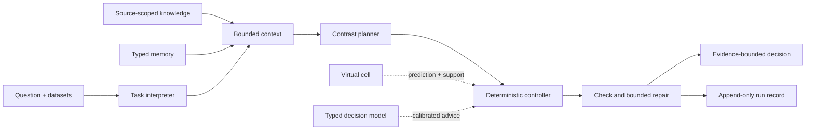

# MAESTRO

**Mechanism-Aware Evidence-driven Scientific Agent for Therapeutic Reasoning and Optimization**

An agent that decides which biological measurement to buy next, and what may be concluded when
the result arrives. It reasons about how pharmacological interventions change biological
systems, treating itself as the decision-maker and a virtual cell as a conditional prediction
tool.

> **Research question.** How can an agent use structured biological evidence and calibrated
> virtual-cell models to form falsifiable mechanism hypotheses, and determine what evidence
> supports a target-development decision?

The core contribution and its formal decision layer are in [`Innovation.md`](Innovation.md).
Downstream tasks and their qualification gates are in [`task.md`](task.md). Designs, protocols
and analyses are in [`research/`](research/README.md).

---

## Layout

| Path | Contents |
|---|---|
| `src/maestro/` | Decision core: contrast, check, repair, belief state, action topology, judgment boundary |
| `src/agent/` | Runtime: task interpretation, knowledge base, memory, context, planner, critics, orchestrator |
| `src/virtual_cell/` | World model: applicability, calibration, State adapter, panels, artifact lineage |
| `src/evaluation/` | Replay environment, policy arms, hidden outcomes, cost and spend ledgers |
| `tools/` | Manifest-scoped adapters the agent invokes on supplied datasets |
| `dataset/` | Local datasets, staged and digest-verified (contents are git-ignored) |
| `research/` | Designs, experiment protocols and analysis code, synchronized as work proceeds |
| `tests/` | Contract tests; each pins one boundary that must not silently move |
| `log/`, `outputs/` | Dated run records and run outputs, written locally |

## Architecture



The planner composes; the controller validates. A failure yields one named repair or an explicit
deferral, never a fabricated plan.

## What the system guarantees

- **Origin never strengthens.** A retrieved claim, a model prediction, a visual reading and a
  typed judgment never become a measurement by appearing in context, memory or a conclusion.
- **Refusals are named.** A missing premise, an unsupported query, an unpriced action and an
  unreachable provider each produce a machine-readable reason, not a silent default.
- **Compression never hides loss.** What does not fit the context budget is listed by identifier
  with a reason; a task that cannot fit refuses rather than truncating.
- **Influence is earned and revocable.** Prediction intervals and typed judgments are scored
  against later measurements; a source that stops calibrating is down-weighted, then revoked.
  Reproducibility is tested first, because it needs no measurement: a source that answers one
  unchanged state differently cannot move a selection, whatever its stated confidence.
- **Adopted is not the same as worked.** The repair ledger records both separately.

## Quick start

Install and run the offline contract tests:

```bash
pip install -e ".[test]"
pytest
```

One bounded interaction with an explicit action catalogue and intervention profile:

```bash
python -m agent "Resolve the genetic-pharmacological discrepancy" \
  --actions actions.json --profile intervention_profile.json \
  --dataset assay_results.csv
```

A resumable multi-round loop that stops before any unsupplied measurement:

```bash
python -m agent "Resolve the genetic-pharmacological discrepancy" \
  --actions actions.json --profile intervention_profile.json \
  --case-id example-case --budget 5 --max-rounds 3 \
  --hypotheses hypotheses.json --results sourced_results.json \
  --state-template state_template.json --trace run.json
```

Useful flags: `--hypotheses` registers the two explanations for every round, so a reworded
model answer cannot end the loop. `--planner-template` answers every structured call from a
reviewed template, running the whole loop with no language model and no paid calls.
`--virtual-cell {state,development_mean,composite,none}` selects the prediction backend.
`--parallel-predictions N` dispatches distinct per-action queries concurrently.
`--decision-critic off` disables the typed second opinion, and `--decision-repeats N` asks it
the same state N times so a ranking can earn the right to move a selection.

Input files: `actions.json` is a list of `EvidenceAction` records; `intervention_profile.json`
records mode, functional-state provenance, abundance status, time, context, spectrum and
sources. Each result object needs `statement`, `source_id`, `quality_passed` and matched
conditions; only an explicit field such as `functional:target_activity:sufficient` marks that
prerequisite measured for the next round.

Run the virtual cell directly, without the agent loop:

```bash
python -m virtual_cell panel --spec panel.json
```

A panel row is planning-only, verifies its artifact against its own digest, and refuses a
gene-set endpoint its output coordinates cannot express.

## Configuration

Provider settings are read from the process environment, falling back to `.env`
(git-ignored; copy [`.env.example`](.env.example)). Values are never printed or logged.

| Variable | Required | Purpose |
|---|---|---|
| `DEEPSEEK_API_KEY`, `DEEPSEEK_BASE_URL`, `DEEPSEEK_MODEL`, `DEEPSEEK_VISION_MODEL` | yes | Text and vision model on an OpenAI-compatible endpoint |
| `TYPESAFE_API_KEY`, `TYPESAFE_ENDPOINT`, `TYPESAFE_MODEL` | no | Typed decision model (TypeSafe Jev). Absent or partial means the critic is simply not built |
| `MAESTRO_LOG_DIRECTORY` | no | Relocates run records; relative paths resolve against the workspace |

## Evaluation

The workflow is ordered: build leakage-bounded cases, establish shared baselines, then evaluate
the core loop. Public case files hold only policy-visible evidence; private files hold outcomes
and evaluator-only scoring rules, revealed only after an action is selected. Each run uses
isolated memory, evidence, log and case state.

```bash
maestro-build-cases --per-archetype 10 --per-gene 6 --overwrite
maestro-evaluate --public-cases data/evaluation/cases/real/public \
  --private-results data/evaluation/cases/real/private \
  --mode decision --policy all --run-id <new-id>
```

`--policy ablation` runs the four comparisons that decide whether any gain comes from the repair
itself: the repairing policy, repair disabled, equal-budget random legal edits, and one-shot
outcome-aware selection. If the second or third matches the first, the repair is not what
produced the difference.

Laboratory cost is priced in wells and turnaround days with shared controls charged once;
provider spend is reserved and charged against a declared ceiling and reported separately.

## Boundaries

This repository contains no validated biological model, no target-engagement claim, no clinical
recommendation and no experimental result. A virtual-cell prediction is never treated as the
outcome of an unmeasured experiment. A typed judgment is a statement about a model's own
accuracy, not about biology.
