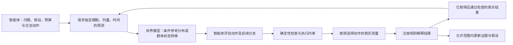

# 当前问题的局部修复与真实数据流动分析

本次没有重构框架。智能体继续负责提出与检查实验、选择动作、读取真实结果并更新证据；虚拟细胞世界模型提供条件预测。代码修复解决了执行约束、历史观测传递和概率语义三处问题，真实数据实验则检验动态预测和两步规划是否有实际收益。

## 1. 已修复的问题

| 问题 | 最小修改 | 验证 |
|---|---|---|
| 启用 discrimination selection、关闭 power-aware 时，选择器拒绝全部动作，执行层仍能执行原计划 | `src/agent/orchestrator.py` 对两种选择模式都执行动作过滤 | 修复前可复现；两种模式都覆盖选择、拒绝和延期测试 |
| 选择器选出的动作未覆盖全部假设时，旧计划覆盖了新选择 | 同一文件将选择结果交给智能体检查 | 回归测试确认控制器看到新动作；控制器仍可因覆盖不足延期 |
| 运行时传入了历史证据，但参考预测器忽略它 | `UpdateRecord` 保留结果标签及当时的候选假设；`ReferenceCardForecaster` 用有效的实测未检出/未解决结果条件化下一轮参考样本 | 测试确认预测改变、假设集合不变；拒绝 QC 失败、条件不匹配、模型预测及另一假设对的旧记录 |
| `dyn_model` 把任意排除概率当成正确排除概率 | 保留 `p_elimination` 和排除 H1/H2 的方向概率；缺少假设条件分布时明确拒绝作为正确率，记录并回退到现有参考预测策略 | 两个方向反例及回退测试通过；真实 AG-14361 案例复现旧 `p_correct=0.70` 实际会排除其真实 PARP 机制 |

最后一项修复的是概率含义。AG-14361 的参考策略仍可能选出错误测量，不能把该修复说成准确率提升。既有默认选择器保持原设置；没有将实验中的新策略提升为默认。



参考预测器的自动历史条件化目前使用最近一次适用的结果；支持不足时沿用原有、在 basis 中标记的未条件化回退。两步研究策略更严格：无配对支持的分支停止。两种规则在记录中明确区分。

## 2. L1000：早期实测状态能否预测晚期状态

数据为本地 GSE92742 LINCS L1000 `subset48`，固定 A549、10 µM、6 h→24 h。先冻结方案，再读取表达矩阵评分。检查了全部 978 个基因确为实测 landmark genes；按完整 InChIKey 分组，训练和测试身份无交叉。纳入 1,204 个化合物条件：960 条训练、244 条测试（243 个测试身份组）。每个时间端点至少两个实验孔、两个实验板。

动态模型为训练集拟合的 ridge 残差转移：

`预测的24h状态 = 实测6h状态 + 训练集平均变化 + ridge(标准化6h状态)`。

中心化、尺度、截距和权重均仅由训练集计算；正则化强度在评分前固定。打乱对照只打乱测试集的早期状态，保持模型和晚期实测不变。区间采用 2,000 次按化学身份分组的配对 bootstrap。

| 模型 | 平均 MSE，越低越好 | 平均 cosine，越高越好 |
|---|---:|---:|
| 保持 6 h 状态 | 13.727 | 0.103 |
| 训练集 24 h 均值 | 7.935 | 0.227 |
| 全局标量校准 | 8.256 | 0.103 |
| Ridge 动态残差 | 8.722 | 0.307 |
| 打乱早期状态 | 12.396 | 0.074 |

动态模型相对保持状态的 MSE 改善为 **5.006 [4.310, 5.761]**；相对打乱早期状态为 **3.674 [2.694, 4.814]**。但是，相对训练均值的改善为 **−0.787 [−1.574, +0.095]**，未证明优于简单均值；平均逐条件 R² 相对零表达轮廓仍为 **−0.421**。这些结果支持早期状态包含后续方向信息，不支持可靠幅度预测或机制决策提升。

本地 Repurposing Hub 精确关联得到 **384/1,204** 个匹配记录，**382** 个有机制注释。关联使用 Broad 化合物 ID 或完整 InChIKey，没有模糊名称匹配；机制注释没有被当作实验靶点结合证据。

实际数据流保存在 [flow_traces.json](../../outputs/acquisition_followup/lincs/flow_traces.json)：预先按哈希选取五个测试身份，逐个记录源端点实测、模型预测、目标端点实测、实验孔/板来源及变化最大的基因。平均变化率是两端点之差除以 18 h，不是瞬时动力学导数。

这是两个不同群体端点的表达状态转移分析，不是单细胞连续轨迹、RNA velocity 或代谢通量。现有数据只有两个时间点，不能据此建立可辨识的连续时间机制模型。使用的历史处理缓存有哈希和尺度说明，但原始预处理脚本缺失；共享实验板相关性也未纳入化合物 bootstrap。

完整统计：[L1000 报告](../../outputs/acquisition_followup/lincs/report.md)、[来源与指标](../../outputs/acquisition_followup/lincs/summary.json)、[数据划分](../../outputs/acquisition_followup/lincs/split.json)。


## 3. SciPlex3：两步规划能否解决单步不足

使用原有骨架留出划分和冻结解释器，在 2,496 个机制对比情境上运行五种策略，共 **12,480 条记录**。这批数据已用于之前的设计，因此本轮是探索性检验，不能宣称独立确认或进行模型提升。

两步策略仅枚举两个测量，并保留每个假设下第一次读数的概率。中性读数不消除假设，但可以改变规划分支的权重；后续预测来自**同一训练参考化合物在两个条件下的配对读数**。没有把两个边缘预测相乘来假设测量独立，也没有将模拟次数计作实测支持。

动作预算统一为最多两次测量、16 个累计 assay-days，时间非递减、不重复测量；效用为正确 +1、错误 −2。收到真实结果后，执行预先计算的条件后续动作。单步效用对照使用相同预测和后续条件分支，仅按即时效用选首个动作，因此可以检查前瞻本身的贡献。

| Tier | 策略 | 正确率 | 错误率 | 效用 |
|---|---|---:|---:|---:|
| A | 原 discrimination selector，约束时间顺序 | 0.426 | 0.039 | 0.348 |
| A | 固定 24 h→72 h | 0.640 | 0.057 | 0.527 |
| A | 单步效用选择＋条件后续 | 0.357 | 0.033 | 0.292 |
| A | 两步条件规划 | 0.366 | 0.036 | 0.295 |
| B | 原 discrimination selector | 0.539 | 0.038 | 0.463 |
| B | 固定序列 | 0.582 | 0.049 | 0.485 |
| B | 单步效用选择＋条件后续 | 0.481 | 0.023 | 0.435 |
| B | 两步条件规划 | 0.481 | 0.026 | 0.428 |

两步减单步的正确率差：A **+0.009 [−0.003, +0.021]**，B **+0.000 [−0.005, +0.006]**。没有获得明确前瞻收益；A 层比固定序列低 **0.274 [0.181, 0.378]**。仅增加两步搜索不能解决参考转移稀疏和预测质量问题，因此该策略只保留为可复现研究代码。

实际分支流进一步说明了问题：A 层两步策略遇到 147 次首测未解决/未检出，仅 41 次继续测量；固定策略的 196 次全部继续。B 层对应为 203/970 和 1,084/1,084。两步策略在缺少配对参考或没有正预测效用时停下，较少取得后续测量；它减少了测量和部分错误，也损失了正确决策。这是本轮观察到的行为差异，不能单凭它断言所有损失均由参考稀疏造成。

比较有两个边界：两步和单步效用策略在 QC 失败后停止，原选择器及固定策略可以继续；世界模型的预测来自通过 QC 的参考数据，尚未建模测量失败概率。与固定策略的差异因此包含 QC 处理差异。本轮按化合物计算区间，B 层有 135 个化合物、132 个骨架，和旧报告按骨架计算的区间不是同一种统计单位。详见 [完整序列结果](../../outputs/acquisition_followup/sequences/report.md) 和 [逐情境记录](../../outputs/acquisition_followup/sequences/episodes.jsonl)。

## 4. 验证与复现

测试环境：`D:\anaconda\envs\maestro\python.exe`，Python 3.11.16。

- 全量运行时测试：**1,326 项通过**。
- 研究回归及真实数据复现测试：**22 项通过**。
- 旧记录复现发现 50 个 `total_variation` 诊断值存在约 1e−16 的跨运行时浮点末位差异；只对该诊断字段使用 1e−14 绝对容差，决策、分数和其余记录仍要求完全一致。没有改写历史结果。
- L1000 划分、逐化合物指标、五条案例复跑一致；统计区间一致。
- 已尝试一次真实 API 智能体测试，返回 **`LLMTransportError`**，未取得回复、未执行测量，两个假设保持不变。在线闭环未验证成功。账本的 $0.01 是失败请求的保守记账，不能当作确认扣费。记录见 [API 结果](../../outputs/acquisition_followup/agent/result.json)。

```powershell
& 'D:\anaconda\envs\maestro\python.exe' -m pytest --basetemp D:\MAESTRO\outputs\followup_tests_new -p no:cacheprovider
& 'D:\anaconda\envs\maestro\python.exe' -m pytest research/acquisition_followup/test_followup.py research/dynamic_world_model/test_dyn_model.py research/dynamic_world_model/test_validator.py research/acquisition_link/test_acquisition_link.py --basetemp D:\MAESTRO\outputs\followup_research_new -p no:cacheprovider
& 'D:\anaconda\envs\maestro\python.exe' research/acquisition_followup/lincs_flow.py
& 'D:\anaconda\envs\maestro\python.exe' research/acquisition_followup/evaluate_sequences.py
& 'D:\anaconda\envs\maestro\python.exe' research/acquisition_followup/plot_flow.py
```

`agent_smoke.py` 会保留已记录的测试，拒绝覆盖已有 API 结果。L1000 和序列脚本会核对冻结方案；本次没有修改全局架构、自动提升新模型或覆盖此前实验。
