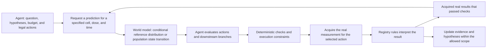

# Local Fixes and Analysis of the Real Data Flow

This round did not refactor the framework. Agents still propose and check experiments, select actions, read real results, and update evidence; the virtual-cell world model provides conditional predictions. The code fixes address execution constraints, historical-observation transfer, and probability semantics. The real-data experiments test whether dynamic prediction and two-step planning provide practical gains.

## 1. Fixed issues

| Issue | Minimal change | Verification |
|---|---|---|
| With discrimination selection enabled and power-aware disabled, the selector rejected every action while the execution layer could still run the original plan | `src/agent/orchestrator.py` now filters actions in both selection modes | Reproduced before the fix; both modes cover selection, rejection, and deferral tests |
| When the selector's actions did not cover all hypotheses, the old plan overwrote the new selection | The same file passes the selected actions to the agent for review | Regression tests confirm that the controller sees the new actions; it can still defer when coverage is insufficient |
| Historical evidence was passed at runtime, but the reference forecaster ignored it | `UpdateRecord` retains result labels and the candidate hypotheses at that time; `ReferenceCardForecaster` conditions the next reference sample on valid measured unresolved/not-detected results | Tests confirm that the prediction changes while the hypothesis set stays unchanged; they reject QC failures, condition mismatches, model predictions, and stale records from another hypothesis pair |
| `dyn_model` treated an arbitrary exclusion probability as the probability of a correct exclusion | Keep `p_elimination` separate from the directional probabilities of excluding H1 or H2; when the hypothesis-conditional distribution is missing, explicitly refuse to treat it as correctness, record the reason, and fall back to the existing reference-prediction strategy | Both directional counterexamples and fallback tests pass; the real AG-14361 case reproduces that the old `p_correct=0.70` would in fact exclude its true PARP mechanism |

The last fix addresses probability meaning. The AG-14361 reference strategy may still choose the wrong measurement; this fix must not be described as an accuracy improvement. The existing default selector keeps its original settings; the experimental strategy has not been promoted to the default.


```mermaid
flowchart LR
    A[Agent: question, hypotheses, budget, and legal actions] --> Q[Request a prediction for a specified cell, dose, and time]
    R[Acquired real results that passed checks] --> Q
    Q --> W[World model: conditional reference distribution or population state transition]
    W --> P[Agent evaluates actions and downstream branches]
    P --> C[Deterministic checks and execution constraints]
    C --> M[Acquire the real measurement for the selected action]
    M --> I[Registry rules interpret the result]
    I --> R
    I --> E[Update evidence and hypotheses within the allowed scope]
```

Automatic historical conditioning in the reference forecaster currently uses the most recent applicable result; when support is insufficient it keeps the original, basis-marked unconditioned fallback. The two-step research policy is stricter: a branch without paired support stops. The records distinguish these two rules explicitly.

## 2. L1000: Can an early measured state predict a later state?

The data are local GSE92742 LINCS L1000 `subset48`, fixed to A549, 10 µM, and 6 h→24 h. The protocol was frozen before reading the expression matrix for scoring. All 978 genes were checked to be measured landmark genes; complete InChIKeys were used for grouping, with no identity overlap between training and test. The analysis includes 1,204 compound conditions: 960 training and 244 test (243 test identity groups). Each time endpoint has at least two experimental wells on two experimental plates.

The dynamic model is a ridge residual transition fitted on the training set:

`Predicted 24 h state = measured 6 h state + training-set mean change + ridge(standardized 6 h state)`.

Centering, scaling, intercept, and weights are computed from the training set only; the regularization strength is fixed before scoring. The shuffled control shuffles only the test-set early states while keeping the model and measured late states unchanged. Intervals use 2,000 paired bootstraps grouped by chemical identity.

| Model | Mean MSE, lower is better | Mean cosine, higher is better |
|---|---:|---:|
| Hold the 6 h state | 13.727 | 0.103 |
| Training-set 24 h mean | 7.935 | 0.227 |
| Global scalar calibration | 8.256 | 0.103 |
| Ridge dynamic residual | 8.722 | 0.307 |
| Shuffled early state | 12.396 | 0.074 |

The dynamic model improves MSE over holding the state by **5.006 [4.310, 5.761]** and over the shuffled early state by **3.674 [2.694, 4.814]**. However, its improvement over the training mean is **−0.787 [−1.574, +0.095]**, so superiority to the simple mean is not established; the mean per-condition R² remains **−0.421** relative to a zero-expression profile. These results support that the early state contains information about the later direction, but they do not support reliable magnitude prediction or a gain in mechanistic decisions.

Exact local Repurposing Hub linkage found **384/1,204** matching records, of which **382** have mechanism annotations. Linkage uses Broad compound IDs or complete InChIKeys, with no fuzzy name matching; mechanism annotations are not treated as evidence of experimental target binding.

The actual data flow is stored in [flow_traces.json](../../outputs/acquisition_followup/lincs/flow_traces.json): five test identities were selected by hash in advance, and each records the source-endpoint measurement, model prediction, target-endpoint measurement, experimental well/plate source, and the genes with the largest changes. The average rate of change is the endpoint difference divided by 18 h; it is not an instantaneous kinetic derivative.

This is a state-transition analysis between two population endpoints, not a single-cell continuous trajectory, RNA velocity, or metabolic flux analysis. The data have only two time points, so they cannot identify a continuous-time mechanistic model. The historical-processing cache includes hash and scale notes, but the original preprocessing script is missing; shared experimental-plate correlation is also not included in the compound bootstrap.

Full statistics: [L1000 report](../../outputs/acquisition_followup/lincs/report.md), [sources and metrics](../../outputs/acquisition_followup/lincs/summary.json), [data split](../../outputs/acquisition_followup/lincs/split.json).


## 3. SciPlex3: Can two-step planning resolve single-step insufficiency?

Using the original scaffold holdout split and frozen interpreter, five strategies were run on 2,496 mechanism-comparison scenarios, for **12,480 records** in total. These data were already used for the previous design, so this round is an exploratory check and cannot claim independent confirmation or model improvement.

The two-step policy enumerates only two measurements and retains the probability of the first readout under each hypothesis. A neutral readout does not eliminate a hypothesis, but it can change the planning-branch weights; subsequent predictions come from paired readouts of the **same training reference compound under both conditions**. The two marginal predictions were not multiplied to assume independent measurements, and simulation count was not treated as measured support.

The action budget is at most two measurements and 16 cumulative assay-days, with non-decreasing time and no repeated measurement; utility is +1 for correct and −2 for wrong. After a real result arrives, the precomputed conditional follow-up action is executed. The single-step utility control uses the same predictions and conditional follow-up branches, but chooses the first action by immediate utility only, allowing the contribution of look-ahead to be assessed.

| Tier | Strategy | Correct | Wrong | Utility |
|---|---|---:|---:|---:|
| A | Original discrimination selector, with time-order constraint | 0.426 | 0.039 | 0.348 |
| A | Fixed 24 h→72 h | 0.640 | 0.057 | 0.527 |
| A | Single-step utility choice + conditional follow-up | 0.357 | 0.033 | 0.292 |
| A | Two-step conditional planning | 0.366 | 0.036 | 0.295 |
| B | Original discrimination selector | 0.539 | 0.038 | 0.463 |
| B | Fixed sequence | 0.582 | 0.049 | 0.485 |
| B | Single-step utility choice + conditional follow-up | 0.481 | 0.023 | 0.435 |
| B | Two-step conditional planning | 0.481 | 0.026 | 0.428 |

The correct-rate difference between two-step and single-step is A **+0.009 [−0.003, +0.021]** and B **+0.000 [−0.005, +0.006]**. No clear look-ahead benefit was obtained; tier A is below the fixed sequence by **0.274 [0.181, 0.378]**. Adding a two-step search alone cannot solve sparse reference transitions and prediction quality problems, so this strategy remains reproducible research code only.

The actual branch flow further shows the issue: in tier A, the two-step strategy saw 147 first measurements that were unresolved/not detected and continued only 41 times; the fixed strategy continued all 196 times. In tier B the corresponding counts were 203/970 and 1,084/1,084. The two-step strategy stops when paired reference support is missing or predicted follow-up utility is not positive, so it obtains fewer follow-up measurements; it reduces measurements and some errors but also loses correct decisions. This observed behavioral difference does not by itself establish that all losses are caused by sparse references.

There are two comparison boundaries: the two-step and single-step utility policies stop after QC failure, while the original selector and fixed strategy can continue; the world-model predictions come from QC-passing reference data, and measurement-failure probability has not yet been modeled. The difference from the fixed strategy therefore includes QC-handling differences. This round computes intervals by compound, with 135 compounds and 132 scaffolds in tier B; that statistical unit is different from the scaffold-based interval in the old report. See the [full sequence results](../../outputs/acquisition_followup/sequences/report.md) and [per-scenario records](../../outputs/acquisition_followup/sequences/episodes.jsonl).

## 4. Verification and reproduction

Test environment: `D:\anaconda\envs\maestro\python.exe`, Python 3.11.16.

- Full runtime test suite: **1,326 passed**.
- Research regression and real-data reproduction tests: **22 passed**.
- Replaying old records found approximately 1e−16 cross-runtime floating-point last-digit differences in 50 `total_variation` diagnostics; only that diagnostic uses an absolute tolerance of 1e−14, while decisions, scores, and all other records still require exact equality. Historical results were not rewritten.
- The L1000 split, per-compound metrics, five case reruns, and statistical intervals all match.
- One real API agent test was attempted and returned **`LLMTransportError`**; no reply was obtained and no measurement was executed, so both hypotheses stayed unchanged. The online loop was not verified successfully. The $0.01 ledger entry is conservative accounting for the failed request and is not confirmation of a charge. See [API result](../../outputs/acquisition_followup/agent/result.json).

```powershell
& 'D:\anaconda\envs\maestro\python.exe' -m pytest --basetemp D:\MAESTRO\outputs\followup_tests_new -p no:cacheprovider
& 'D:\anaconda\envs\maestro\python.exe' -m pytest research/acquisition_followup/test_followup.py research/dynamic_world_model/test_dyn_model.py research/dynamic_world_model/test_validator.py research/acquisition_link/test_acquisition_link.py --basetemp D:\MAESTRO\outputs\followup_research_new -p no:cacheprovider
& 'D:\anaconda\envs\maestro\python.exe' research/acquisition_followup/lincs_flow.py
& 'D:\anaconda\envs\maestro\python.exe' research/acquisition_followup/evaluate_sequences.py
& 'D:\anaconda\envs\maestro\python.exe' research/acquisition_followup/plot_flow.py
```

`agent_smoke.py` preserves recorded tests and refuses to overwrite existing API results. The L1000 and sequence scripts verify the frozen protocol; this round did not modify the global architecture, automatically promote a new model, or overwrite earlier experiments.
