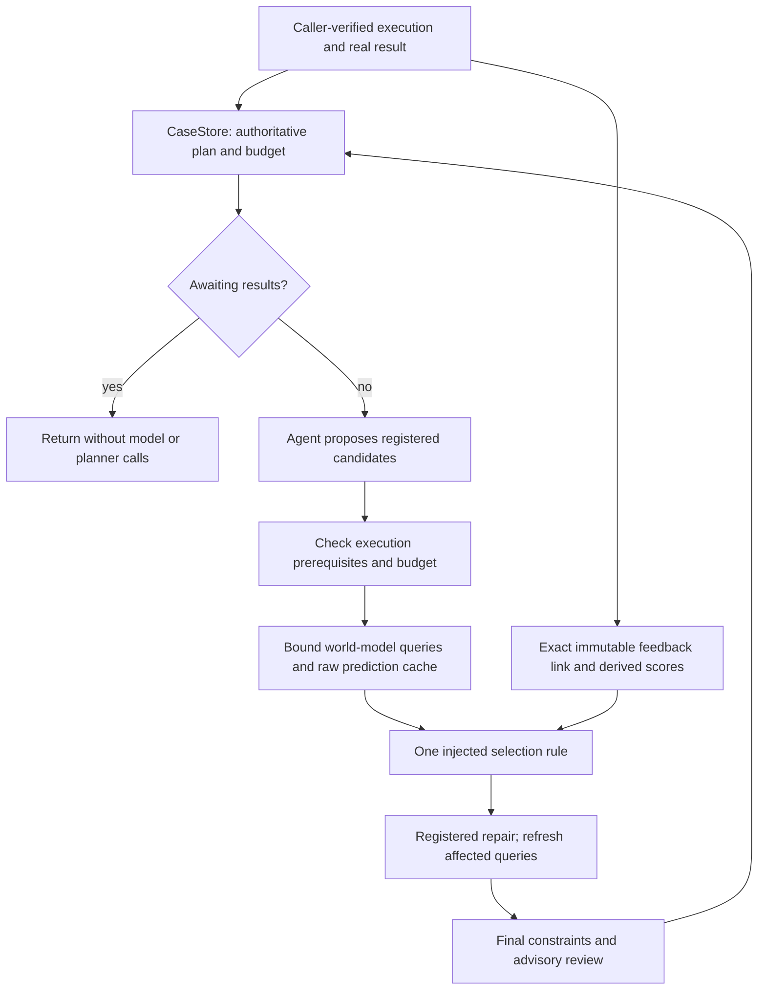

# ASTRA: dual-core research adjustments

The latest [feedback and ownership follow-up](FEEDBACK_BOUNDARY_FOLLOWUP.md) fixes
CLI plan attribution and committed-bundle draining, puts promoted contracts in
default tests, and separates research training/replay from production inference.
Its [measured-realisation design](results/20261003_feedback_boundary_v1/realisation_intake_v3/readiness.json)
is unexecuted; supplied `research/data` files contain no new measurement table.

The latest [dual-core contract optimization](DUAL_CORE_OPTIMIZATION.md) implements
shared selection/admission, durable feedback attribution and arm failure handling.
Full maestro regression passes1,924tests. A corrected480-well pilot remains an
unexecuted proposal; the four-arm scientific design and evidence gaps are explicit.

This research implementation applies the two supplied scientific and architecture reviews.
It preserves the agent and world-model responsibilities, with one plan-submission path and
an exact prediction/attempt/result feedback ledger. The second round promotes only tested
engineering contracts into existing production files; see [ROUND2.md](ROUND2.md).
Engineering verification, historical prediction diagnostics, and observed policy value are
different evidence levels. The last remains unidentified.

## Entry points and scope

| File | Responsibility |
|---|---|
| [decision_path.py](decision_path.py) | Minimal opt-in decision runner using the production `CaseStore`, with injected planner, predictor and selector. |
| [interface.py](interface.py) | Research-only `StateRef`, `ScientificQuery`, `ExecutionBinding` and raw cache identity; supported prediction types remain production-owned. |
| [feedback.py](feedback.py) | SQLite derived pairing and categorical scores, not a biological evidence authority. |
| [../../src/maestro/case_update.py](../../src/maestro/case_update.py) | Authoritative promoted scoring; the retired forwarding module is preserved in the new inert source archive. |
| [paired_state.py](paired_state.py) | Real official STATE inference with the same actual basal tensor for every planned action. |
| [paired_matrix.py](paired_matrix.py) | Frozen three-pool, three-seed technical matrix; original surrogate and tie rule retained. |
| [state_interaction.py](state_interaction.py) | Action contrasts, top-choice vs abstention changes, residual alignment, matched permutations and development-only shrinkage. |
| [../../src/agent/orchestrator.py](../../src/agent/orchestrator.py) | Supported orchestrator; callers now import it and the STATE adapter directly. |
| [realisation_plan.py](realisation_plan.py) | Read-only review-input audit, unregistered measured-action development specification and empty intake tables. |
| [influence_audit.py](influence_audit.py) | Real STATE dependency audit, frozen-grid influence and constructed forecast/policy/timing swaps. |
| [PROTOCOL.md](PROTOCOL.md) | Admission rules, scientific questions and the next independent experiment. |

Run from `D:\MAESTRO` using `D:\anaconda\envs\maestro\python.exe`.
The existing editable MAESTRO package and installed STATE assets are required. No dependency
or checkpoint change was made. The query/predictor bridge and experimental execution remain
explicit caller responsibilities; the runner is not a drop-in production CLI replacement.

## One decision path



`DecisionPath.run` returns before reasoning while the authoritative case is waiting.
It rejects unaffordable or unexecutable candidates before prediction. An interpretation gate
can restrict mechanism inference without making an assay illegal. A model-required action
cannot proceed after absent, refused or structurally invalid prediction. Unsupported model
queries can still leave legal evidence acquisition available when the action does not require
the model. Typed `StatePrediction` refusals and contract errors are checked explicitly.

The planner supplies registered action/query pairs. The selector cannot invent candidates;
repair cannot alter the registered intervention, population, context, endpoint, time or
conditioning event. A changed authenticated state or execution binding triggers a new raw
query. The caller must authenticate replacement states. Removing a query removes its stale
forecast. Bundle affordability and final execution constraints precede one `record_plan`.
The final reviewer is advisory and cannot silently reselect an action.

`prediction_use="diagnostic"` is the default: the selector receives no predictions.
`selection` is explicit and does not itself validate the injected policy. Existing conservative
expected-coverage behavior in production is untouched; this work does not restore amplitude
priority or invent a favorable score. Expensive support checks inside a predictor remain the
backend's responsibility; no new global scheduler or persistent GPU worker is introduced.

## Query and feedback identity

Raw prediction identity includes state content and feature-axis hashes, preprocessing,
experimental unit and role, intervention, population, context, endpoint, horizon,
conditioning mode, checkpoint, input transformation, sampled-index hash, seed and runtime.
It excludes downstream utility, reliability weights and case IDs. Raw reuse is process-local;
selection is always recomputed. State references and hashes are supplied by the caller.
`available_at` is an identity assertion, not authenticated chronology. Scientific admission
must establish processing completion and decision availability independently.

The research `FeedbackLink` binds case, version, plan, action, attempt and prediction; the result ID binds
the final record. An execution cannot be rebound to a new prediction. Equal retries are
idempotent; conflicting content, unknown attempts and cross-case matches are rejected.
The ledger shares a database safely through `astra_*` tables but never writes CaseStore facts,
budget or mechanism beliefs. A caller can import the authoritative fact first and retry derived
scoring after interruption. The integration test verifies one budget charge and one score;
it does not claim atomic transactions across the two writes or a deployed ingestion service.

Feedback forecasts are conditional on a valid measurement. They are not the probability
that an attempted experiment succeeds. QC, condition matching and detection are explicit;
conditions must be certified by the caller. Unknown independent units do not enter scoring.
Full-category Brier uses a sum over categories; log loss uses the natural logarithm, with
zero-probability observations recorded as infinite rather than silently clipped.
Correctly forecasting `unresolved` can score well while excluding no mechanism hypothesis.
No weights are fitted online and no physical uncertainty interval is inferred from row counts.
The promoted `ingest_result` still inherits EpisodeStore's action-based projection. Production
durable linkage is an explicit CaseStore API joining its accepted original-plan results;
it is not automatically wired to orchestrator scoring. Research `FeedbackStore` remains a
separate prototype; its self-reported execution references are not authoritative CaseStore facts.

## Actual research findings

The original nine STATE requests used different actual basal tensors across their actions,
despite equal seed labels. All nine therefore fail the new pairing check. Historical EGR1
has 10 zero means out of 27 and four exact top ties. One concrete action switch and six
abstention changes are distinct phenomena; seed averages choose the highest dose in every pool.
The new paired technical matrix is reported separately in
[paired matrix results](results/20261002_paired_matrix_v1/summary.json).

The corrected matrix completes 9/9 cells. Each action triplet uses the same actual basal
tensor. It has 18/27 zero EGR1 means and 7/9 numerical abstentions. Nine between-pool
same-seed comparisons contain zero concrete action switches, four abstention changes and
five pairs that both abstain; within-pool seed comparisons have the same counts.
Seed-averaged choices are 5 uM / 0.5 uM / 5 uM for plate1/plate10/plate11. This aggregate
difference is not stable individual benefit: every plate10 request abstains, and its middle
dose sits on the zero boundary in each seed. There is no observed outcome accuracy or utility
comparison. Forty new actual model forwards were executed in this round, 30 for candidates
and 10 for controls; the grid references 36 of them and does not double-count its reused cell.

Two same-input paired executions produced bitwise identical 48-by-2000 candidate predictions
(maximum difference zero). Actual basal hashes match across all three action forwards;
the separate control forward is not a candidate action or an experiment.
[Verification](results/20261002_paired_state_verification/README.md) includes exact commands
and the first version's missing source-snapshot caveat.

ReSisTrace's saved RidgeRNA predictions already implement mean plus residual. Descriptive
residual alignment is positive but its amplitude is too large:

| Saved context | kappa: mean true/predicted residual product | v: mean squared predicted residual |
|---|---:|---:|
| Carboplatin | 0.025814 | 0.308423 |
| Growth | 0.042501 | 0.238522 |

Both satisfy `v > 2*kappa`, explaining why adding the current residual increases squared
error. This is diagnosis on already opened outcomes, not a development estimate of a new
shrinkage coefficient. No coefficient is selected or tested here.

Matched-only permutation MSE is 0.588028 / 0.483306, versus visible MSE
0.534303 / 0.399456. The original all-baseline permutation is 0.714392 / 0.560998.
Restricting the permutation removes the added population replacement in the old diagnostic;
it still cannot remove unverified descendant detection or certify biological exchangeability.
[Frozen diagnostics](results/20261002_interaction_v2/diagnostics.json) retain original sources,
hashes and scope. No ReSisTrace refit, test-selected shrinkage or physical confidence interval
was performed. Technical split/control-cancellation utilities are contract-tested but have
not been run as a biological replication study.

## Reproduce and inspect

```powershell
$py = 'D:/anaconda/envs/maestro/python.exe'
& $py -m pytest -o addopts= -q research/astra
& $py -m research.astra.verify --allow-promotion --full --out research/astra/results/NEW_VERIFICATION_DIRECTORY
& $py -m research.astra.state_interaction --out research/astra/results/NEW_INTERACTION_DIRECTORY
& $py -m research.astra.paired_matrix --out research/astra/results/NEW_PAIRED_DIRECTORY
```

Every experiment requires a new output directory. The matrix command references its explicitly
hashed plate1/seed42 technical execution from paired version 2 and executes the other eight
cells. Large H5AD/NumPy artifacts stay local under the scoped ignore policy; receipts pin their
hashes, and the frozen historical sources and checkpoint must be available to regenerate them.
The originals of the four supplied code files remain byte-preserved in
[baseline manifest](baseline_20261002/manifest.json). The reviews are preserved with source
hashes under `evidence/`. An unexpected intermediate change to the research orchestrator was
captured before restoring only its import and waiting adjustments; the writer is unknown.
Additional `arms.py`, `world3.py`, `world_model.py` and `state_runner.py` copies appeared in
that same interval. Their bytes were archived and unused active duplicates removed; no results from
those reference/world-model copies are presented as STATE. Their source identities are
included in the verification freeze, without claiming import or behavior certification.

Detailed test receipts, failures and evidence limits are indexed in
[the daily record](../../log/20261002/README.md). No remote API call, physical experiment,
RNA precision recertification, new data-source qualification or net deployment-value experiment
was performed. Production changes are bounded engineering repairs; see the second-round report.

The first-round final scoped regression run passed **273 tests**, including **74 ASTRA tests**,
with zero failures or skips. Original four-copy hashes, all eleven frozen matrix inputs and
96 output manifest entries match; protected production/data/history paths have no tracked
changes during that round. The full repository suite was not run in the first round. See
[first-round verification receipt](results/20261002_verification_v2/receipt.json) and
[second-round report](ROUND2.md) for later production and full-suite checks.

Second-round final verification passed **1,861 tests**, including **118 ASTRA contracts**,
with zero failures or skips. Only four existing production/tool files were changed; tracked
file counts remain44 under `src` and913 under `tools`. See
[full verification receipt](results/20261002_round2_verification/receipt.json).

The subsequent [EGR1 zero and refusal audit](ZERO_AUDIT.md) traces all18 exact-zero
action means to strictly negative pre-ReLU values, with9 bitwise-identical real
STATE replays. It separates numerical ranking, meaningful action advantage and
measured benefit; Plate10's aggregate middle-dose rank remains an unvalidated
hypothesis. No new production/tool policy is promoted.

The [eight-question follow-up](EIGHT_QUESTIONS.md) adds a native observed-RNA action
coverage audit:146 Trametinib cells,5 nonzero EGR1 values, six dose/plate conditions
and no within-plate action pair. It defines separate decision-value and mechanism-
value evidence chains and per-question continue/modify/stop criteria. Descriptive
RNA differences and three-seed ranks do not identify intervention utility.

The [independent GDSC review](GDSC_INDEPENDENT_REVIEW.md) verifies the supplied PR's
2,517 native ATP action records, policy intervals and split. It adds complete
contribution, denominator and all-date omission diagnostics. The tested density
increment remains negative; the background association remains positive but causal,
prospective state and agent gains are unestablished. The PR is inspected in an
isolated pinned snapshot and is not merged by this review.

The [GDSC transport follow-up](GDSC_TRANSPORT_FOLLOWUP.md) acquires the full official
release and original CTRPv2 archive. A frozen two-action diagnostic on 200 later scans
gains4.207pp versus development-fixed PD, but loses0.961pp to fixed PLX in a separate
post-outcome diagnostic. CTRP lacks the exact menu. A randomized three-action pilot
allocation is generated and contract-tested; no physical execution, STATE forward or
cheap-state value is claimed. See [transport verification](results/20261002_gdsc_transport_verification_v1/receipt.json).
