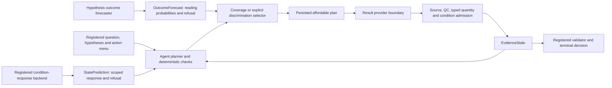

# Registered dual-core workflow completion

**File summary**

- **Path:** `research/dual_core_completion/README.md`
- **Purpose:** Implement and verify the runtime gaps found by collaborative module and data review after Round 2.
- **Core points:** Forecasts can change plans; only qualified observations can change scientific evidence. A backend must refuse a prediction mode it does not implement. Every executed action must belong to the persisted, affordable plan.
- **Interfaces / data:** `verify.py`, `DATA_READINESS.md`, `data_readiness.json`; existing production entry points and frozen Round 2 evidence.
- **Depends on:** `src/agent/`, `src/maestro/`, `src/virtual_cell/`, `tools/datasets/`, `tools/evaluation/` and their contract tests.

## Executable architecture



STATE predicts registered condition-level transcript response; it does not supply a reading distribution or a measured premise. Its target-expression invariance, row-count sensitivity and unsupported row deletion remain the Round 2 interface findings. Research WorldV2 predicts readings under its fitted research protocol and is unavailable for a new no-training swap without saved fitted transitions. Case-memory forecasts hypothesis-conditional outcomes under their declared sampling frame. Oracle results remain diagnostic ceilings.

The standard factory accepts an explicit `outcome_forecaster` and `discrimination_selection`. The default remains shadow forecasting; enabling discrimination is an explicit caller choice. A `valid_readout` forecast cannot stand in for the probability distribution of all attempted experiments. Missing QC probabilities and missing decision-time state are not filled in by the framework.

## Acceptance criteria

| Module | Required behavior | Verification |
|---|---|---|
| Condition-response backends | Refuse unsupported hypothesis/history inputs before inference | `tests/test_condition_response_modes.py` |
| Case-memory interface | Name only modes actually implemented by its outcome model | Mode contract tests and data-readiness audit |
| Standard agent factory | Preserve injected forecaster and shadow/active semantics | `tests/test_orchestrator_execution_authority.py` |
| Runtime plan and budget | Refused or unaffordable actions never reach the result provider | Execution authority regressions |
| Replay integration | Authorized results advance a configured runtime case through the same planned-result import gate | Production replay and isolation regressions |
| Prerequisite chain | Sufficient qualified prerequisites permit the next legal repair; failed or insufficient evidence does not | Typed evidence and real CLI contract tests |
| Offline reviewed planner | Complete a measured contract loop without online provider credentials | `tests/test_offline_dual_core_entrypoint.py` |
| Evidence and terminal decision | Predictions never become measured evidence; QC/context/type gates remain binding | Existing biological closure, forecast and source-lineage suites |
| Historical study | No frozen source, raw input or result is overwritten | Full SHA-256 comparison by `verify.py` |

## Reproduction

Use the existing maestro environment from the repository root:

```powershell
& 'D:\anaconda\envs\maestro\python.exe' -m research.dual_core_completion.verify --out outputs/dual_core_completion_20261001/verification_rerun
```

The verifier writes code hashes, the exact command, package versions, pytest XML and historical integrity checks into a fresh directory. Two existing constructed model-fitting tests are excluded. The review does not fit a new research model, change production selection defaults, resolve unlinked source records by prediction, or reclassify development data as independent validation.

Recorded verification receipts are published under [results/20261001/](results/20261001/manifest.json). The final run has 1,526 passes and one inherited Markdown-language failure, with all 63 new contract checks passing. No runtime test fails; the strict receipt correctly remains `passed: false`. All 333 declared frozen files and 39 reviewed source hashes match. Exact commands and source identities distinguish the first failing run, its replay repair and the final fixture-isolation check. The verifier checks declared local frozen inputs; a clone needs those registered assets. A missing asset does not pass validation.

The final publication check has 178 passes. It covers dependent fixtures and document/index contracts after removing only surplus EOF blank lines from two new fixture files; its receipt records final source hashes and the exact change from the full-suite snapshots. Production runtime source is unchanged. This focused check explicitly excludes the inherited prose failure and the two fitting tests; its counts overlap with the full suite.

See `DATA_READINESS.md` and `data_readiness.json` for dataset-specific targets, independent units, exposure history, available state and blocked analyses. Runtime completeness within registered contracts is separate from proof of terminal benefit, new-domain support, external risk calibration or prospective biological validation.
