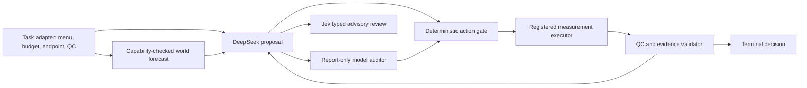

# Dual-core design, technical value and evaluation limits

The implemented framework separates action proposals, conditional forecasts,
qualified measurements and terminal decisions. This round improves operational
reliability and makes these boundaries testable with actual DeepSeek and Jev
requests. It does not establish a new biological foundation model or assume that
adding an LLM improves a registered deterministic planner.

## Roles and reusable contract

The proposal contract contains registered action identifiers, remaining budget,
attempted actions and qualified prerequisite identifiers. The dedicated
`agent.model_audit.ModelAuditAgent` returns immutable findings and input hashes;
it has no client, executor, repair method, evidence store or replacement action.
The caller applies the existing execution gate. Non-JSON inputs are reported with
an explicitly unavailable hash, rather than inventing a digest. Provider reviewer
answers remain separate from deterministic findings.

The contract does not name SciPlex3 or L1000. A task adapter is responsible for
creating the menu and qualifying evidence under its own endpoint/QC rules. Six
constructed contract families exercise budget, attempted actions, prediction
provenance, failed QC, late availability and unsupported forecasts. They demonstrate
interface reuse, not transfer to six independent scientific domains. Biological
adapters retain their registered conditions and existing exposure histories.

| Component | Information and authority | Implemented change and value |
| --- | --- | --- |
| DeepSeek | Public task/menu/forecasts and purchased evidence; proposes actions | Shared response-envelope guard, protocol errors instead of raw exceptions, reported usage retained even without usable text |
| Jev | Same public card/proposal; typed advisory judgments | Named refusals on malformed envelopes; repeated judgments from different served versions/states are rejected before ledger writes |
| World interface | Checkpoint-specific capability contract; predictions are planning-only | Nonfinite/unserializable history rejected before cache identity or backend invocation |
| Inference dispatch | Exact input identity, preserving history/control/context/checkpoint | One inference per distinct query within a round even if reuse across rounds is disabled; rebinding retains request lineage and zero additional compute |
| Dedicated auditor | Public contract/proposal only; reports defects | Immutable report, no state change, repair or execution authority; independently checked by a separate review agent |
| Evidence/terminal validator | Purchased, available, QC-qualified observations | Existing authority retained; API text cannot create a measurement or eliminate a hypothesis |
| Run records | Explicit source/input/request/output hashes and served model | Default runtime logs use the execution date; explicit frozen-directory overrides remain supported |

Production STATE predicts registered condition responses; research WorldV2 predicts
readings; case-memory forecasting estimates outcomes conditional on a declared
sampling frame. They remain different backends. The live biological pilot uses
the frozen ReferenceWorld, not STATE, WorldV2 or case memory. Diagnostic oracles
have no deployed policy role. A real predecision-state gain arm remains unrun
because the required measurement/availability/sample relation is absent.

## Novelty assessment and related work

An agent with tools and a critic is established architecture. The technical
contribution to test here is the explicit connection between forecast support,
validity denominators, action selection, evidence permission and terminal value,
with partial identification where reachable observations are missing. This is a
candidate systems contribution; the present experiments do not prove first-in-
literature novelty, a new learning algorithm or superiority to the whole field.

Tau-bench evaluates final task state and repeat reliability, which motivates
scoring the terminal state rather than accepting plausible explanations. This
round does not run its customer-service suites or estimate pass^k from repeated
identical live tasks. ([Yao et al., 2024](https://arxiv.org/abs/2406.12045v1))

ToolEmu separates tool emulation and failure evaluation, with human checks on
their validity. This motivates an independent reviewer and explicit limits on
synthetic findings. MAESTRO uses registered outcomes, not an LLM-generated
biological outcome simulator. ([Ruan et al., 2024 revision](https://arxiv.org/abs/2309.15817v2))

AgentDojo treats untrusted tool data as a separate evaluation problem. Forecast
text and advisory output in MAESTRO have no execution/evidence authority. This
round does not run prompt-injection attack suites or claim an AgentDojo score.
([Debenedetti et al., 2024 revision](https://arxiv.org/abs/2406.13352v3))

These three primary abstracts were accessed on 2026-10-01; the complete papers
were not read for this extension. The previous focused virtual-cell/decision
literature review and its access ledger are preserved in
[the earlier review](../dual_core_followup/LITERATURE.md). Existing model-metric
debates support retaining simple baselines and evaluating selected actions and
registered terminal outcomes separately from global reading accuracy.

## Fixed experiment and estimands

The complete population, prompts, costs, hypotheses, source hashes and request
limits are written before execution. There is no outcome-based prompt/model
search or training. Each provider receives the same public information. Hidden
labels and unpurchased results are available only to the evaluator/executor.

| Experiment | Population and comparison | Primary metrics |
| --- | --- | --- |
| Live capability smoke | Two identical cards per provider, no scientific outcome | Protocol acceptance, legal action, provenance judgment, latency and reported tokens |
| General contract benchmark | Six families x four fixed variants; fixed ordering, public one-step optimizer, raw/gated DeepSeek, report-only Jev | Task success, legality, refusal, forecast regret, paired family-level effects, evidence/terminal boundary violations |
| Blinded defect review | Twenty-four bad proposals paired with twenty-four clean controls; authority/action/schema defects | Precision, recall, false-positive rate, unavailable answers; deterministic auditor checked separately |
| Biological API pilot | Twelve hash-selected episodes, six per task, max two registered measurements; fixed/one-step/gated DeepSeek | Correct/wrong/undetermined/deferred, measurements/days, terminal utility, cost-adjusted utility, paired chemical-unit effect, reachable-result coverage |
| Engineering regressions | Independently reproduced defects plus existing contracts | Before/after failures, exact inference counts, lineage, immutable state and refusal containment |

Terminal utility is +1 correct, -2 wrong and zero undetermined/deferred. The pilot
also reports net utility minus 0.02 per measurement; days consume the independent
registered time budget. These are different columns, not interchangeable claims.
The one-step optimizer is a declared public-forecast comparator, not the existing
multistep baseline planner or a hidden-outcome oracle. The earlier frozen audit
supplies the multistep/factorial comparisons.

General-task confidence intervals resample whole contract families; blinded
review controls share their scenario and family. Biological comparisons first
average within chemical skeleton/component and then resample those units. Six
episodes per task give only a pilot. Physical plate/batch dependence is reported
separately: one connected physical component per task cannot support an
independent physical-cluster interval. Missing reachable results retain declared
terminal-utility bounds [-2, 1] and cost-adjusted bounds [-2.04, 1] under the
two-measurement cap; model predictions never fill them for point identification.

## Pre-experiment hypotheses and expected conclusions

H1: deterministic gating prevents observed illegal execution and evidence
permission violations. It may increase refusal, so compare coverage, common-
decided risk, accuracy and cost as well as total utility. Passing constructed
cards establishes contract conformance under those inputs, not universal safety.

H2: exact within-round deduplication reduces backend calls for repeated identical
queries while preserving output lineage and distinct-input separation. No
hardware/STATE inference-speed claim follows from offline call-count tests.

H3: live DeepSeek can obey the public action contract and Jev can identify narrow
defects. Neither is assumed better than a deterministic optimizer. Provider
latency, usage and false positives are part of practical value; an advisory
component that adds overhead without a measured benefit is optional.

H4: a biological terminal improvement remains a testable hypothesis. A confidence
interval or identification bound crossing zero, a forecast/action disconnect,
or an action change without terminal change prevents a general improvement
claim. The fixed pilot cannot establish external-data generalization, learned
model improvements or new-dose/time/compound STATE support.

## Cleanup and next evidence requirements

The shared UTF-8/JSON/object envelope decoder replaces duplicated decoding and
normalization logic while keeping provider-specific retries/refusals. Removed
usage-accounting duplication is relocated before text acceptance. The independent
cleanup review found no genuinely unused runtime imports; seven apparent AST
candidates are required by type annotations. Historical research, fixtures and
frozen results are retained.

A claim of broad superiority needs an untouched external benchmark, prespecified
task adapters and endpoints, repeated live calls for reliability, adequate
independent units, complete attempted-experiment denominators, comparable action
coverage and an empirical cost schedule. Those requirements are not replaced by
larger numbers of correlated cells or synthetic mutations. No such external
claim is made in this delivery.

## Negative-result repair and prospective check

An explicit optional research support contract now requires an available,
finite, strictly positive public forecast for a forecast-dependent measurement
proposal. Violations may only fall back to defer, never to an evaluator-selected
alternative action. Fixed/no-forecast policies remain legal when the optional
contract is absent. This does not strengthen evidence or terminal permission.

The original four unsupported selections are contained in exact-response replay.
A new eight-card, four-family check retains the original prompt and freezes new
values before calls: raw and gated proposals all pass, so no new model/action gain
is observed. Jev's two incorrect objective judgments remain in the record and
have no decision authority. Public numerical rules belong in deterministic code;
models may propose or advise on questions requiring interpretation.

Separate uncertainty reanalysis removes four single-unit reading confidence
intervals while retaining all estimates and frozen originals. Non-improvement
of biological endpoints remains a scientific result: no validator is weakened
and no missing outcome is filled to make it disappear.
