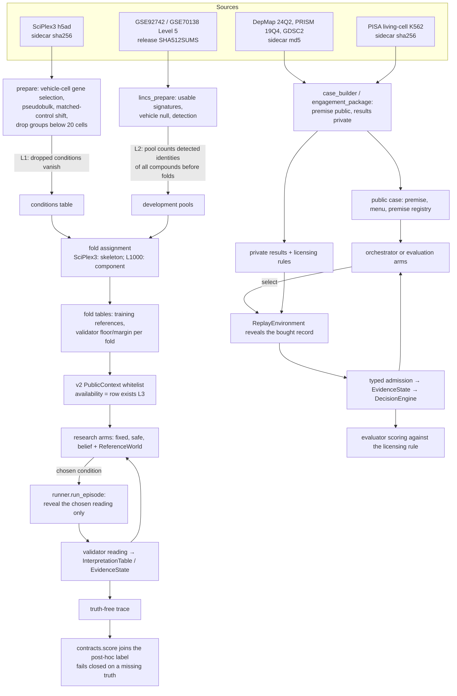
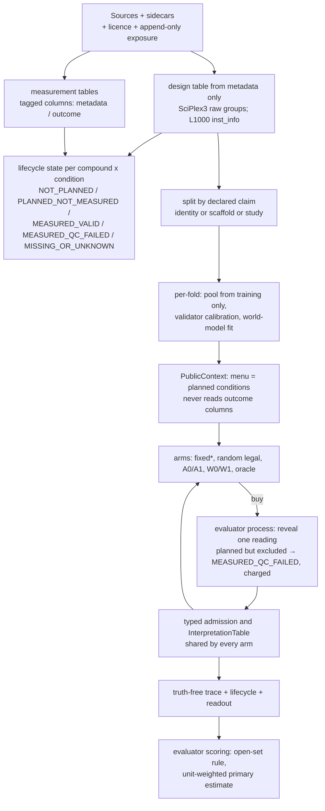

# Data flow, access boundaries and one real trajectory

Companion to [AUDIT.md](AUDIT.md). Leak points are marked **L1-L4** and refer to audit rows.

## 1. Current flow (as executed on `e5ad68f`)

**Access boundaries as they stand.**

| Boundary | Policy side sees | Evaluator side only | Enforcement | Threat model |
|---|---|---|---|---|
| Research harness (v2) | Training reference tables, validator parameters, menu, pool, structures, unit keys, row-existence availability | Held-out profiles, QC, detection, labels | `PublicContext` whitelist (`contracts.py:182`); `run_episode` returns only the chosen reading | In process. It stops honest code from reading by accident. It does not stop code that opens the files itself. |
| External study | Nothing before the vault opens | Everything | `Vault.open` once, with a freeze check and access log (`firewall.py:440`) | Same process and user rights, so the access log is the control. |
| Replay cases | Public case file | Private results, licensing rules, final tests | Separate directories; `CaseRepository` reveals on purchase | Same process. |
| Registered records | - | - | Write-once API plus read-only flag (`registry.py:151`) | `chmod` is reversible, so the digests in `EVIDENCE.json` are the control. |

**Leak points found by execution.**
- **L1 / L3 (D8):** 12 SciPlex3 conditions were profiled, then dropped for having fewer than 20 cells. The v2 menu does not offer them, so an outcome shapes the legal menu.
- **L2 (D7):** L1000 development pools count detected identities over all compounds, before the fold split.
- **L4 (E3):** unregistered derivative citations count as independent sources in production.

## 2. Proposed flow (smallest change)

Changes from the current flow, and nothing more:
1. Availability comes from design metadata (L1, L3).
2. Pools are built per fold from training compounds (L2).
3. Lifecycle and readout are separate fields.
4. A planned but excluded condition is charged and returns `MEASURED_QC_FAILED`.
5. Reveal runs in a separate evaluator process that alone can open sealed paths (for sealed cohorts only).
6. An unregistered source reports `dependence_unknown` instead of counting as independent (L4).

Every arm keeps the same validator and admission code (no weakened comparator).

**Authoritative update path, unchanged:** a real result goes through `InterpretationTable.interpret`, then
`admit_evidence`, then `EvidenceState.apply`, then `DecisionEngine`. Forecasts, retrieved text, typed judgments and LLM
drafts can rank or propose, but none of them enters this path.

## 3. Threat model

- **In scope:** accidental reads by research code, analyst peeking during development, and label-derived
  construction. Controls: the whitelist view, metadata-only construction, write-once records, and digests re-checked
  at archive time.
- **Partly in scope:** a policy that deliberately opens sealed files. Only process and filesystem separation helps,
  proposed for sealed cohorts (PLAN.md P2-3).
- **Out of scope:** an adversary with the same OS account. The vault and read-only flags do not stop them; the audit
  trail (access logs, digests, git history) only detects it.
- **Observed in practice:** concurrent agents (Codex sessions) rewrote registered artefacts on 2026-09-27
  (`research/experiments/external-validation-1/EVIDENCE.json`). The control that caught it was digest verification,
  not access control.

## 4. Source-grounded example trajectory (real replay, not constructed)

Run `gated-plan-engagement-20260927` (`outputs/gated_plan_20260927/engagement_replay/`), arm `registry_repair_rule`, case
`eng-atr-ve-821-ach000551`. Every field below is copied from the case file or the run record.

| Field | Value |
|---|---|
| Case and context | ATR, VE-821, K562 (`ACH-000551:K562`), split `development` |
| Premise (public) | DepMap 24Q2 ATR gene effect -1.5062 (99.0% of models at or below -0.5) [retrieved_source]; GDSC2 8.5 VE821 in K-562, IC50 36.97 uM, AUC 0.9526 [derived_analysis]; curated target ATR [retrieved_source] |
| Contrast | `insufficient_functional_perturbation` → `revise_intervention` vs `genetic_pharmacological_mode_non_equivalence` → `change_intervention_mode` |
| Missing prerequisite | `engagement:index_on_target`. Typed requirement: quantity `engagement_shift`, entity `ATR@ve821`, units `log2_pisa_vehicle_referenced_shift`, context `ACH-000551:K562`, direct measurement required. No menu action supplies it; the matched assay (`matched_target_engagement`, cost 3.0) is registered unavailable. |
| Candidate actions | `dependency_selectivity_profile` (1.0), `target_abundance_rna` (1.0), compiled `repair__pisa_living_cell_engagement_k562__ve821__atr` (1.0) |
| Proposal and admission | `register_supplier(capability=pisa_living_cell_engagement_k562, supplies=engagement:index_on_target, compound=ve821, entity=ATR)`. Compiled: true. Admitted: true. Refusal: none. |
| Prediction version and support | **None.** No world model forecasts engagement in this package; this is the prediction-free path (fallback F). |
| Recorded selection rationale | "The plan cannot read its evidence without 'engagement:index_on_target', and this capability declares that premise for this subject in this context." Trace: candidates as above; chosen: the repair action; remaining budget 3.0. |
| Revealed measurement | PISA living-cell release: ATR stability shift +0.0627 log2 (replicates 0.0607, 0.0648), rank 1826 of 6857, vehicle-null threshold 0.2200 (held-out false-positive rate 0.0358, upper 0.0368). Call `not_engaged`. Exposure `undeclared_in_local_asset`. |
| Verification | Record validated; biological quality passed; interpretation fields `engagement:index_on_target`, `engagement:index_on_target:not_engaged`. Promise closed by a real result. |
| Permitted evidence update | Premise admitted at its scope. Licensed decision set: {`revise_intervention`}. |
| Terminal decision | `revise_intervention` (origin: `interpretation_rule`); 1.0 cost unit; 0 wells; 0 days; 1 record retrieval. |
| Scoring | "Correct" under the package's licensing rule. Independent final test: `partition_absent` (no kinobeads record for this pair). |
| What the trace does **not** show | That VE-821 fails to engage ATR at the viability-screen exposure: the exposures are not matched, and `not_engaged` has no measured sensitivity. Also, the same-information control `registry_expanded_selection` made the same choice at the same cost on this case. |
